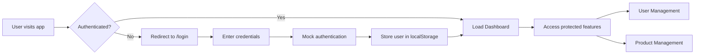

# Angular Application - Project Summary

## 🚀 Overview
Modern Angular v20 application with authentication, user management, and reusable component architecture. Built with TypeScript in strict mode, featuring lazy-loaded modules and reactive state management.

## 📦 Technology Stack

| Technology | Version | Purpose |
|------------|---------|---------|
| Angular | 20.3.0 | Core framework |
| TypeScript | 5.9.2 | Language (strict mode) |
| RxJS | 7.8 | Reactive programming |
| Jasmine/Karma | Latest | Unit testing |
| Zone.js | 0.15.0 | Change detection |

## 🏗️ Architecture Overview

```
src/
├── app/
│   ├── core/                 # Singleton services & guards
│   │   ├── services/
│   │   │   ├── auth.ts       # Authentication service
│   │   │   ├── user.service.ts # User CRUD operations
│   │   │   └── api.service.ts  # HTTP base service
│   │   └── guards/
│   │       └── auth-guard.ts  # Route protection
│   │
│   ├── features/             # Lazy-loaded feature modules
│   │   ├── auth/            # Login & authentication
│   │   │   └── components/
│   │   │       └── login/   # Login form component
│   │   └── dashboard/       # Protected dashboard
│   │       └── components/
│   │           ├── dashboard/  # Main dashboard layout
│   │           ├── users/      # User management
│   │           └── products/   # Product management
│   │
│   ├── shared/              # Reusable components
│   │   └── components/
│   │       ├── input/       # Form input
│   │       ├── button/      # Button component
│   │       ├── table/       # Data table with sorting
│   │       ├── modal/       # Modal dialogs
│   │       ├── alert/       # Alert messages
│   │       ├── card/        # Card container
│   │       ├── spinner/     # Loading spinner
│   │       ├── header/      # App header
│   │       ├── sidebar/     # Navigation sidebar
│   │       └── footer/      # App footer
│   │
│   ├── app.routes.ts        # Main routing configuration
│   ├── app.config.ts        # App configuration
│   └── app.ts               # Root component
```

## 🔐 Authentication System

### Auth Service (`core/services/auth.ts`)
- **State Management**: RxJS BehaviorSubject for reactive auth state
- **Storage**: User data persisted in localStorage
- **Mock Auth**: Accepts any username/password for development

**Key Methods:**
```typescript
login(username: string, password: string): Observable<User>
logout(): void
isAuthenticated(): boolean
currentUserValue: User | null
```

### Auth Guard (`core/guards/auth-guard.ts`)
- Functional guard implementation
- Protects dashboard routes
- Preserves intended destination via `returnUrl` query parameter

## 📊 Feature Modules

### 1. Authentication Module
**Path**: `/login`
- Reactive forms with validation
- Auto-redirect after successful login
- Return URL handling for protected routes

### 2. Dashboard Module
**Path**: `/dashboard` (protected)

#### Users Component Features:
- **CRUD Operations**: Create, Read, Update, Delete users
- **Advanced Table**:
  - Sortable columns
  - Real-time search filtering
  - Pagination support
- **Modal Dialogs**:
  - Add user form with validation
  - View user details
- **User Feedback**:
  - Success/error alerts
  - Auto-dismiss after 5 seconds
  - Loading states

#### Integration with Backend:
```typescript
// User Service Methods
getAllUsers(): Observable<User[]>
getUserById(userId: bigint): Observable<User>
createUser(user: Partial<User>): Observable<User>
updateUser(userId: bigint, user: Partial<User>): Observable<User>
deleteUser(userId: bigint): Observable<any>
```

## 🧩 Shared Components Library

### Form Components
| Component | Purpose | Features |
|-----------|---------|----------|
| InputComponent | Text input | Validation support, custom styling |
| TextareaComponent | Multi-line text | Auto-resize, character count |
| ButtonComponent | Action buttons | Multiple variants, loading state |

### Data Display Components
| Component | Purpose | Features |
|-----------|---------|----------|
| TableComponent | Data tables | Sorting, pagination, row selection |
| CardComponent | Content container | Header, body, footer slots |
| AlertComponent | User notifications | Success/error/info types, dismissible |

### Layout Components
| Component | Purpose | Features |
|-----------|---------|----------|
| HeaderComponent | App header | User info, logout |
| SidebarComponent | Navigation | Collapsible, menu items |
| FooterComponent | App footer | Copyright, links |
| ModalComponent | Dialog windows | Customizable size, backdrop |

## 🛣️ Routing Configuration

```typescript
const routes: Routes = [
  {
    path: 'login',
    loadChildren: () => import('./features/auth/auth-module')
  },
  {
    path: 'dashboard',
    loadChildren: () => import('./features/dashboard/dashboard-module'),
    canActivate: [authGuard]
  },
  {
    path: '',
    redirectTo: '/dashboard',
    pathMatch: 'full'
  }
];
```

## 🎯 Key Design Patterns

1. **Standalone Components**: Modern Angular approach for better tree-shaking
2. **Lazy Loading**: Feature modules loaded on-demand for performance
3. **Service-based State**: RxJS for reactive state management
4. **Functional Guards**: Modern guard implementation replacing class-based guards
5. **Reactive Forms**: Type-safe form handling with built-in validators
6. **Dependency Injection**: Tree-shakable services with `providedIn: 'root'`

## 🔄 Application Flow



## 🛠️ Development

### Quick Start
```bash
# Install dependencies
npm install

# Start development server
npm start

# Run tests
npm test

# Build for production
npm run build

# Build with watch mode
npm run watch
```

### Available Scripts
| Command | Description |
|---------|-------------|
| `npm start` | Start dev server on http://localhost:4200 |
| `npm test` | Run unit tests with Karma |
| `npm run build` | Production build |
| `npm run watch` | Development build with file watching |

### Testing
- Framework: Jasmine + Karma
- Test files: `*.spec.ts`
- Coverage: `ng test --code-coverage`
- Single file: `ng test --include='**/path-to-file.spec.ts'`

## 📋 TypeScript Configuration

```json
{
  "compilerOptions": {
    "strict": true,
    "strictNullChecks": true,
    "strictFunctionTypes": true,
    "strictBindCallApply": true,
    "strictPropertyInitialization": true,
    "noImplicitThis": true,
    "noImplicitAny": true
  }
}
```

## 🚦 Project Status

### Implemented Features
✅ Authentication system with guards
✅ User management CRUD operations
✅ Reusable component library
✅ Lazy-loaded feature modules
✅ Responsive layout with header/sidebar/footer
✅ Form validation
✅ API service integration
✅ Loading states and error handling

### TODO/Improvements
- [ ] Implement real backend API integration
- [ ] Add user edit functionality
- [ ] Implement product management features
- [ ] Add unit tests for all components
- [ ] Implement refresh token mechanism
- [ ] Add internationalization (i18n)
- [ ] Implement dark mode theme
- [ ] Add data export functionality

## 📝 Notes

- **Mock Authentication**: Currently accepts any username/password combination
- **API Integration**: UserService is ready for backend integration
- **State Management**: Consider implementing NgRx for complex state requirements
- **Performance**: Lazy loading implemented for optimal initial load time

## 🤝 Contributing

1. Follow Angular style guide
2. Maintain strict TypeScript configuration
3. Write unit tests for new features
4. Use reactive forms for all form implementations
5. Keep components standalone when possible

## 📄 License

[Your License Here]

---

Generated on: ${new Date().toISOString().split('T')[0]}